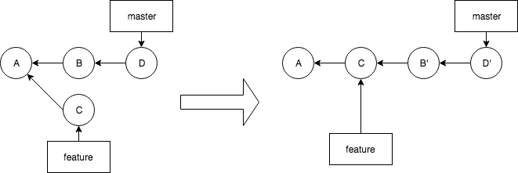

# Codelab: none conflicting rebase

A rebase is a different kind of merge, keeping a more linear git commit history. This is an optional codelab
which was not covered in the presentation, but mentioned in the additional topics later on.

As with codelab 02, we start from the same situation where file.txt was modified on 2 branches (non-conflicting).
This time, we will use a different merge strategy, called a *rebase*.

With a rebase, the merges of the *feature* branch will be put between commit A and our changes. So our changes will
be on top of the *feature* branch changes. This is different compared to the merge operation, where the changes
of the *feature* branch were places on top of the changes of the *master* branch.



As you can see, there are no 'parallel' branches, every commit has only one parent. This was not the case with
a merge, where the 'commit M' had two parent commits.

## Setup (clone)
The setup is identical to codelab 02.

```
git clone https://github.com/switchfully/git-starter-01 starter01
cd starter01
git checkout feature
git checkout master
```

This is the result (head pointing to master branch):

```
$ git log --all --decorate --oneline --graph
* c4b0120 (HEAD -> master) commit D
* 77a4170 commit B
| * 9d8f024 (feature) commit C
|/  
* f6ad194 commit A
```

## 2. Rebase

Try the rebase and observe the difference with a merge from codelab:

As we merge the *feature* branch into the *master* branch, we must checkout the *master* branch first.
Then do rebase

```
$ git checkout master
$ git rebase feature
First, rewinding head to replay your work on top of it...  (1)
Applying: commit B                                         (2)
Using index info to reconstruct a base tree...
M	file.txt
Falling back to patching base and 3-way merge... 
Auto-merging file.txt                                      (3)
Applying: commit D                                         (4)
Using index info to reconstruct a base tree...
M	file.txt
Falling back to patching base and 3-way merge...
Auto-merging file.txt                                      (5)
```

What happened? Inspect:
```
$ git log --all --decorate --oneline --graph
* 59b8cc0 (HEAD -> master) commit D
* 7370ea1 commit B
* 9d8f024 (feature) commit C
* f6ad194 commit A
```
Notice that the hash value of commit B is `7370ea1`, while before, is was `77a4170`. So this is NOT the previous
commit B. It is a NEW commit B'. Same goes for commit D'. Why?

* (1) For the master branch, the HEAD is placed on `9d8f024`, which is the commit C on *feature* branch. So this *rewinds*
commit B and commit C
* (2) Git calculates what was done in commit B. (create a patch). Then it applies those changes on the HEAD in (1), resulting
in a new commit B'. (3) Resolving the concurrent changes in the file file.txt (which was changes both in the *master* branch and 
the *feature* branch).
* (4) (5) Same thing for commit D resulting in a commit D'.

Commit B and commit B' are different because B' now has commit C as a parent, while commit B had commit A as a parent.
Commits in git are immutable, so to change this a new commit B' had to be made.

Look at the contents of the file `file.txt`. Is it the same as in the merge codelab?

## 3. Rebase or merge?

The advantage of a rebase is that you get a flat history. With a merge, you got a history where C and B D where
in parallel. A flat history is easier to reason about.

But: what happened to the original commit B (`77a4170`) and commit C (`9d8f024`)? They are *gone*. They were replaced
by commit B' and commit C'.
What happens if commit B and commit C were already in a remote repository and some other developer has changes on top of it?
*It becomes a mess!*

> NOTICE:
NEVER DO A REBASE IF THE CHANGES ON YOUR BRANCH ARE ALREADY ON A REMOTE BRANCH

We suggest that you only do a rebase if you know exactly what your are doing. Rewriting history is destructive, and causes
problems when that history is already on a remote server.
